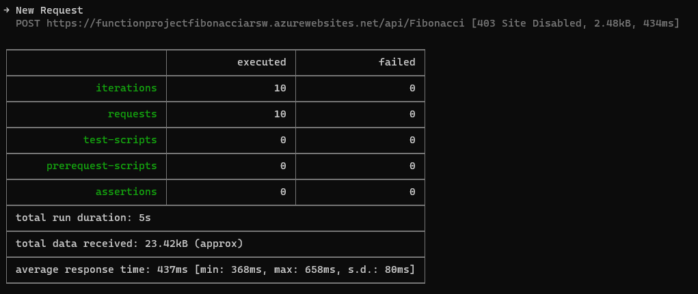

### Escuela Colombiana de Ingeniería
### Arquitecturas de Software - ARSW

### Desarrollado por: Daniel Santiago Gómez Zabala

## Escalamiento en Azure con Maquinas Virtuales, Sacale Sets y Service Plans

### Dependencias
* Cree una cuenta gratuita dentro de Azure. Para hacerlo puede guiarse de esta [documentación](https://azure.microsoft.com/es-es/free/students/). Al hacerlo usted contará con $100 USD para gastar durante 12 meses.
Antes de iniciar con el laboratorio, revise la siguiente documentación sobre las [Azure Functions](https://www.c-sharpcorner.com/article/an-overview-of-azure-functions/)

### Parte 0 - Entendiendo el escenario de calidad

Adjunto a este laboratorio usted podrá encontrar una aplicación totalmente desarrollada que tiene como objetivo calcular el enésimo valor de la secuencia de Fibonnaci.

**Escalabilidad**
Cuando un conjunto de usuarios consulta un enésimo número (superior a 1000000) de la secuencia de Fibonacci de forma concurrente y el sistema se encuentra bajo condiciones normales de operación, todas las peticiones deben ser respondidas y el consumo de CPU del sistema no puede superar el 70%.

### Escalabilidad Serverless (Functions)

1. Cree una Function App tal cual como se muestra en las  imagenes.

    

    

    Se hizo la creación del Function App

    

2. Instale la extensión de **Azure Functions** para Visual Studio Code.

    

    Dentro de Visual realizaos la instalación de la extensión y se visualiza dentro de la imagen del siguiente punto

3. Despliegue la Function de Fibonacci a Azure usando Visual Studio Code. La primera vez que lo haga se le va a pedir autenticarse, siga las instrucciones.

    

    

    Se realiza el despligue de la app a Azure

    

4. Dirijase al portal de Azure y pruebe la function.

    

    Se realizaron las pruebas, dentro de la iamgen se muestra la entrada y la salida

    

    

5. Modifique la coleción de POSTMAN con NEWMAN de tal forma que pueda enviar 10 peticiones concurrentes. Verifique los resultados y presente un informe.

    Enviamos 10 peticiones concurrentes con 10 iteraciones cada petición

    * Iteración 1
        
    * Iteración 2
        
    * Iteración 3
        
    * Iteración 4
        
    * Iteración 5
        
    * Iteración 6
        
    * Iteración 7
        
    * Iteración 8
        
    * Iteración 9
        
    * Iteración 10
        

    **Conclusiones:** Encontramos que hubo un tiempo promedio de 4.9 segundos las 10 peticiones que se realizaron siendo las más demoradas la petición 4 y la petición 9. Además durante la ejecución de las 10 peticiones no hubo ninguna iteación fallida.

6. Cree una nueva Function que resuleva el problema de Fibonacci pero esta vez utilice un enfoque recursivo con memoization. Pruebe la función varias veces, después no haga nada por al menos 5 minutos. Pruebe la función de nuevo con los valores anteriores. ¿Cuál es el comportamiento?.

    Al utilizar memorización, podemos evitar recalcular los números de Fibonacci que ya se han calculado. Esto puede mejorar significativamente el rendimiento del cálculo, especialmente para valores grandes de n. El comportamiento más significativo seria la reducción en la ejecución de la petición.

    Primera petición:
    

    Segunda petición después de 5 minutos:
    

**Preguntas**

* ¿Qué es un Azure Function?
    
    Azure Functions es un servicio en la nube que opera bajo demanda y ofrece la infraestructura y recursos necesarios para ejecutar aplicaciones de manera continua y actualizada. Su enfoque permite a los desarrolladores centrarse en el código relevante en el lenguaje más productivo para ellos, mientras que Functions se encarga de los aspectos operativos. Esta plataforma brinda un entorno sin servidor en Azure, siendo versátil para la creación de API web, la respuesta a cambios en bases de datos, el procesamiento de secuencias de IoT, la gestión de colas de mensajes, entre otras funcionalidades.

* ¿Qué es serverless?

    El término "serverless" se refiere a una solución que posibilita la rápida creación y ejecución de aplicaciones con un menor costo total de propiedad. Aunque en realidad hay servidores operando en segundo plano para ejecutar las aplicaciones, la gestión de estos servidores, sistemas operativos, software y demás recursos recae en el proveedor de la nube. Esto significa que los desarrolladores ya no necesitan preocuparse por la administración de la infraestructura, pudiendo centrarse exclusivamente en el código de la aplicación. Esta aproximación agiliza el proceso de desarrollo y reduce la carga operativa.

* ¿Qué es el runtime y que implica seleccionarlo al momento de crear el Function App?
    
    El "runtime" en Azure Functions determina el entorno de ejecución para tus funciones. Al seleccionarlo al crear una Function App, estás eligiendo el lenguaje de programación y el entorno específico en el que se ejecutarán tus funciones. Es importante elegir el runtime adecuado desde el principio, ya que cambiarlo después puede ser complicado.

* ¿Por qué es necesario crear un Storage Account de la mano de un Function App?

    La cuenta de almacenamiento (Storage Account) ofrece un espacio de nombres único para datos accesibles globalmente a través de HTTP o HTTPS. Los datos son duraderos, altamente disponibles, seguros y altamente escalables. Al asociar una cuenta de almacenamiento con una Function App, se habilitan operaciones de almacenamiento y gestión esenciales para las diversas funciones en ejecución.

* ¿Cuáles son los tipos de planes para un Function App?, ¿En qué se diferencias?, mencione ventajas y desventajas de cada uno de ellos.

    Existen tres tipos de planes para Azure Functions:

    1. **Plan de Consumo**: Escala automáticamente y se paga solo por los recursos de proceso utilizados durante la ejecución de funciones. Las instancias del host de Functions se añaden y eliminan dinámicamente según la demanda. Es ideal para cargas variables, ya que escala automáticamente incluso en momentos de carga elevada.

    2. **Plan Premium**: Escala automáticamente según la demanda y utiliza trabajos preparados previamente para ejecutar aplicaciones sin demoras. Las instancias son más eficientes y se pueden conectar a redes virtuales. Este plan es adecuado para aplicaciones que se ejecutan continuamente o casi continuamente, con ejecuciones frecuentes y mayores requisitos de CPU, memoria, o tiempo de ejecución.

    3. **Plan de Azure App Service**: Las Functions se ejecutan en el plan de App Service con tarifas normales. Este plan es útil para operaciones de larga duración y proporciona costos y escalado más predecibles. Es ideal cuando ya se tienen máquinas virtuales infrautilizadas ejecutando otras instancias de App Service o cuando es necesario ejecutar funciones en una imagen personalizada.

* ¿Por qué la memorizaciónn falla o no funciona de forma correcta?

    Esta función falla debido a un problema de recursividad y almacenamiento de valores que afecta su rendimiento. La estrategia de almacenar valores para optimizar búsquedas futuras se vuelve ineficiente con números grandes, ya que consume rápidamente la memoria, impidiendo el funcionamiento adecuado de la función.

* ¿Cómo funciona el sistema de facturación de las Function App?

    
    Esta función se factura según el consumo de recursos, medido en gigabytes por segundo (GB*s). La factura se calcula multiplicando el tamaño medio de la memoria en gigabytes por el tiempo en milisegundos que dura la ejecución de la función. La memoria se mide redondeando al alza a los 128 MB más cercanos, hasta un máximo de 1.536 MB. El tiempo de ejecución se redondea al alza a los 1 ms más cercanos, con un mínimo de 100 ms. Además, hay una concesión gratuita de recursos cada mes en los precios de Azure Functions.

* Informe
